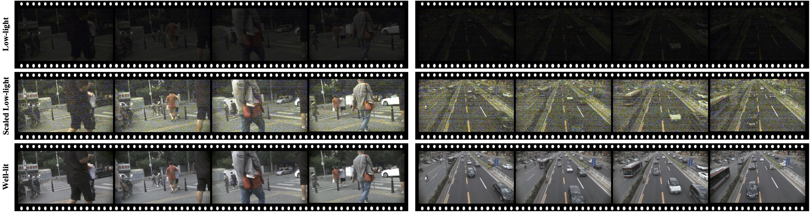

# Multi-Object Tracking in the Dark

The official repo of the CVPR 2024 paper [Multi-Object Tracking in the Dark](https://arxiv.org/abs/2405.06600)





## News
<!-- * [TODO] code release
* [TODO] codalab test
* [TODO] pull request TrackEval -->
<!-- * [TODO] Testing website is under development. -->
* [2024-06] 🔥 LMOT Dataset are available now ! 


## Abstract

Low-light scenes are prevalent in real-world applications (e.g. autonomous driving and surveillance at night). Recently, multi-object tracking in various practical use cases have received much attention, but multi-object tracking in dark scenes is rarely considered. In this paper, we focus on multi-object tracking in dark scenes. To address the lack of datasets, we first build a **L**ow-light **M**ulti-**O**bject **T**racking (**LMOT**) dataset. LMOT provides well-aligned low-light video pairs captured by our dual-camera system, and high-quality multi-object tracking annotations for all videos. Then, we propose a low-light multi-object tracking method, termed as **LTrack**. We introduce the adaptive lowpass downsample module to enhance low-frequency components of images outside the sensor noises. The degradation suppression learning strategy enables the model to learn invariant information under noise disturbance and image quality degradation. These components improve the robustness of multi-object tracking in dark scenes. We conducted a comprehensive analysis of our LMOT dataset and proposed LTrack. Experimental results demonstrate the superiority of the proposed method and its competitiveness in real night low-light scenes


## Dataset


### Construction

LMOT dataset is collected using our dual-camera sysyem, which provide well-aligned low-light and well-lit video pairs (LMOT-dual). We also collect a real low-light MOT dataset to evaluate performance in real night dark scene, which are captured using a single camera with the same camera settings (LMOT-real).

We provide the dataset in both RAW (RGGB) and sRGB format, with 20FPS, 10ms exposure time, and $1800\times1000$ resolution. LMOT dataset contains a variety of city outdoor scenes, including roads, overpasses, pedestrians, and intersection. We annotate six types of moving objects, including car, person, bicycle, motorcycle, bus, and truck. All annotations are carefully reviewed.


### Statistics

Detailed statics and data splits for LMOT dataset
<table>
  <tr>
    <td>Dataset</td>
    <td>Split</td>
    <td>Videos</td>
    <td>Bbox</td>
    <td>Tracks</td>
    <td>Paired Well-lit</td>
  </tr>

  <tr>
    <td rowspan="3">LMOT-dual</td>
    <td>train</td>
    <td>11</td>
    <td>309,466</td>
    <td>1,533</td>
    <td>&#x2714</td>
  </tr>
  <tr>
    <td>val</td>
    <td>4</td>
    <td>131,781</td>
    <td>626</td>
    <td>&#x2714</td>
  </tr>
  <tr>
    <td>test</td>
    <td>11</td>
    <td>312,742</td>
    <td>1,644</td>
    <td>&#x2714</td>
  </tr>

   <tr>
    <td>LMOT-real</td>
    <td>real</td>
    <td>6</td>
    <td>61,561</td>
    <td>287</td>
    <td>&#x2716</td>
  </tr>
</table>


### Download

LMOT dataset can be downloaded from [Baidu Drive](https://pan.baidu.com/s/1OHojTQSTdDaybuflYGwaMw) (code:xedx). 

***Note:** Currently, we only release the training set and validation set. Test set and the remaining part will be released later along with the challenges.*

Organize the files into the following structure.

```
{LMOT ROOT}
└── LMOT_release/
    ├── train
        ├── LMOT-02
            ├── gt
                └── gt.txt
            ├── img_dark
                ├── 000001.tiff
                └──  ... 
            ├── img_dark_rgb
                ├── 000001.tiff
                └──  ... 
            ├── img_light_rgb
                ├── 000001.jpg
                └──  ... 
            ├── img_light
                ├── 000001.tiff
                └──  ... 
            └── seqinfo.ini
        ├── LMOT-04
        └── ...
    ├── val
        └── ...
    ├── test
        └── ...
    └── real
        ├── RLMOT-01
            ├── gt
                └── gt.txt
            ├── img_real
                ├── 000001.tiff
                    ... 
            ├── img_real_rgb
                ├── 000001.jpg
                    ... 
            └── seqinfo.ini
        └── ...
```

LMOT dataset is organized in the form of [MOT Challenge 17](https://motchallenge.net). Each line in gt.txt contains

```
fn, id, classid, x1, y1, w, h, c=-1, c=-1, vis_ratio, c=-1
```

The 6 categories of annotated objects include
```
'person', 'bicycle', 'car', 'motorcycle', 'bus', 'truck'
```


<!-- #### Evaluation -->


## People

In addition to the authors of the paper, some of my friends also helped with data collection and annotation, they are [Li Yichen](https://github.com/yumu-173), [Wang Binfeng](wbf_bit@163.com), Wang Haoyu, [Wang Yuran](https://github.com/laowang404), [Zhang Taoying](https://github.com/TaoYing-Zhang), and [Wang Jianan](https://github.com/whiteknight-WJN). We sincerely thank them for their contributions to this work. 


## Agreement

* LMOT dataset is licensed under a [Creative Commons Attribution-NonCommercial 4.0 International License](https://creativecommons.org/licenses/by-nc/4.0/).
* LMOT dataset is available for non-commercial research purposes only.
* The code of this repository is released under the MIT License.


## Citation
If you our dataset or code for research, please cite our paper:
```
@InProceedings{wang2024lmot,
    author    = {Wang, Xinzhe and Ma, Kang and Liu, Qiankun and Zou, Yunhao and Fu, Ying},
    title     = {Multi-Object Tracking in the Dark},
    booktitle = {Proceedings of the IEEE/CVF Conference on Computer Vision and Pattern Recognition (CVPR)},
    year      = {2024},
    pages     = {382-392}
}
```


